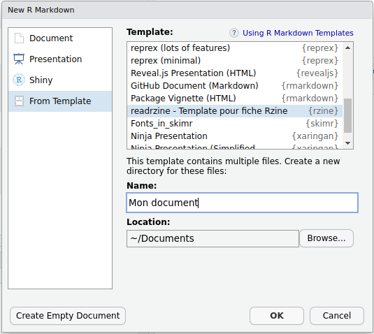

```{r setup, include=FALSE}
knitr::opts_chunk$set(echo = TRUE)
library(htmltools)
library(emoji)
library(knitr)
```

```{css firstpagebg, echo=FALSE}
.title-slide {
  background-image: url('assets/sharon-mccutcheon-576867-unsplash.jpg');
  background-size: cover;
  background-position: center;
  background-blend-mode: lighten;
}
```


## Exemple simple : rmd en pdf 

```{r, echo=FALSE}
tmp_files <- tempfile(fileext = c(".md", ".html"))
names(tmp_files) <- c("md", "html")
tmp_files <- as.list(tmp_files)

writeLines(
  c(
    "~~~~~~markdown",
    paste0(readLines("simple.Rmd")),
    "~~~~~~"
  ),
  con = tmp_files$md
)

rmarkdown::pandoc_convert(
  input = tmp_files$md, 
  to = "html5", 
  output = tmp_files$html,
  options = c("-s",  '-M',  'title=Fichier source (.rmd) :'  ,'-M', 'lang="fr"')
)

srcdoc <- paste(readLines(tmp_files$html), collapse = "\n")

div(class = "columns-2",  

    tags$embed(src= "simple.pdf", type="application/pdf", width="100%", height="500px"),
        div(tag("iframe", list(srcdoc = srcdoc, style = 'height:500px!important;'))

  )
)
```

## Prise en main facile avec RStudio

Menu `File > New File > R Markdown...`

```{r  include = TRUE, eval = TRUE, echo = FALSE, fig.align='center', out.width="60%"}
include_graphics("img/create_rmd.png")
```

## Choix du format et du template

```{r  include = TRUE, eval = TRUE, echo = FALSE, fig.align='center', out.width="70%"}

```

## Enregistrer le fichier .rmd crée

```{r  include = TRUE, eval = TRUE, echo = FALSE, fig.align='center', out.width="100%"}
include_graphics("img/untitled2.png")
```

## Compiler (*knit*) un Rmarkdown

```{r  include = TRUE, eval = TRUE, echo = FALSE, fig.align='center', out.width="100%"}
include_graphics("img/knit2.png")
```


## Fichier généré (exemple HTML) 

<iframe src="mon_premier_rmarkdown.html"></iframe>


##  `r emoji('knit')` Tricot d'un Rmarkdown ?

```{r include = TRUE, eval = TRUE, echo = FALSE, fig.align='center', out.width="100%"}
include_graphics("img/schema_rmd.png")
```

<font size="4">Pandoc est généralement pré-installé sur les systèmes d'exploitation MACOS et Windows.</font>    
<font size="4">Si vous n'avez pas $\LaTeX$ d'installé, utilisez le package [`tinytex`](https://cran.r-project.org/package=tinytex) pour la compilation en pdf.</font>


## Rappel : les 3 composants d'un rmd

```{r include = TRUE, eval = TRUE, echo = FALSE, fig.align='center', out.width="100%"}
include_graphics("img/rmardown.PNG")
```

## Rappel : les 3 composants d'un rmd

- **En-tête `YAML`** : indications de variables pour la compilation du document : métadonnées (titre, auteur, date...), type de document souhaité (format et template), options de mise en page (TOC, Bibliographie, CSS...).    
<font size="4">Documentation &rarr; [***R Markdown: The Definitive Guide***](https://bookdown.org/yihui/rmarkdown/html-document.html).</font>  

- **Texte balisé en `Markdown`** : texte en langage naturel mis forme grâce à la syntaxe markdown.    
<font size="4">Documentation &rarr; [***Learn X in Y minutes***](https://learnxinyminutes.com/docs/markdown/)</font>  

- **_Chunks_** : code qui sera affiché (ou pas) et dont le résultat sera inséré (ou pas) dans le document final. Plusieurs options permettent de gérer l'éxécution,  l'affichage du code et de résultats.   
<font size="4">Documentation &rarr; [***Chunk options and package options***](https://yihui.org/knitr/options/)</font>  


## En-tête du document (`YAML`)

```yaml
---
title: Créez vos documents avec R Markdown
author: Romain Lesur
date: 21 janvier 2019
output: 
  ioslides_presentation:
    widescreen: true
    self_contained: false
    logo: "assets/meetuprnantes.jpeg"
    keep_md: true
---
```

[`r fontawesome::fa('exclamation-triangle', fill= "red")` **Attention à l'indentation**]{}


## Multipliez les format de sortie

Avec `output`, vous pouvez produire plusieurs formats à partir du même fichier source : 

```yaml
---
title: Créez vos documents avec R Markdown
author: Romain Lesur
date: 21 janvier 2019
output: 
  html_document: default
  pdf_document: default
---
```

Exécuter dans la console :

```r
rmarkdown::render("monfichier.Rmd", output_format = "all")
```

## Type de documents

Vous pouvez produire :

- des documents HTML
- des documents paginés (articles, livres, thèses) : pdf avec $\LaTeX$, docx, odt...
- des présentations : HTML et pptx
- des tableaux de bord
- des cours et sujets d'examens
- des sites internet statiques

## Modèles prêts à l'emploi

De nombreux packages fournissent des modèles prêts à l'emploi : `rmarkdown`, `flexdashboard`, `hrbrthemes`, `komadown`, `komaletter`, `learnr`, `linl`, `memor`, [`papaja`](https://github.com/crsh/papaja), `pinp`, `prettydoc`, `radix`, `revealjs`, `rmdformats`, `rmdshower`, `rticles`, `tufte`, [`unilur`](https://koncina.github.io/unilur/), `vitae`, `xaringan`...

Pour les livres et thèses : `bookdown`

Pour les sites web : `blogdown`

## Des packages pour aider sur des taches spécifiques

Tout un écosystème de packages pour aider : 

- l'incroyable `officer` de David Gohel pour MS Office
- `tinytex` pour installer facilement $\LaTeX$
- pour les tableaux : `flextable` (David Gohel), `kableExtra`, `gt`...

## Des documents paramétrés

A partir du même fichier R Markdown, produire des rapports sur différentes zones géographiques, différentes périodes...

```yaml
---
title: My Document
output: html_document
params:
  annee: 2018
  region: Europe
---
```

Disponible depuis le bouton `Knit` de RStudio ou

```r
rmarkdown::render("monfichier.Rmd", params = list(annee = 2018, region = Europe))
```

## Texte balisé en `markdown`

## Ligne de code


## `knitr` chunks {data-background="assets/2rg8dc.jpg" data-background-position="50% 75%" data-background-size="35%"}

## Deux façons d'insérer du code dans son document

1. Code chunk  

    ````r
    `r ''````{r, eval=TRUE, echo=FALSE}
    head(mtcars)
    ```
    ````
    
    De nombreuses options ! [yihui.name/knitr/options](https://yihui.name/knitr/options/)
    
1. Inline code 

    ````markdown
    La moyenne est de `r '\x60r mean(mtcars$cyl)\x60'`.
    ````

## Différents langages autorisés

```{r}
names(knitr::knit_engines$get())
```

## Exemple : `python` avec le package `reticulate` {.smaller}

```{r, include=FALSE, eval=FALSE}
library(reticulate)
use_python("usr/local/bin/python")
use_virtualenv("r-reticulate")
py_install(c("pandas", "numpy"))
```

1. Initialisation de la configuration

    ````r
    `r ''````{r, include=FALSE, eval=FALSE}
    library(reticulate)
    use_python("usr/local/bin/python")
    use_virtualenv("r-reticulate")
    py_install(c("pandas", "numpy"))
    ```
    ````

1. Script python

    ````py
    `r ''````{python, eval=FALSE}
    a = 1
    print(a)
    ```
    ````

    ```{python, eval=FALSE}
    a = 1
    print(a)
    ```

## Communication entre R et python {.smaller}

```{python, echo=FALSE, eval=FALSE}
import pandas as pd
import numpy as np

dates = pd.date_range('20130101', periods=6)
df = pd.DataFrame(np.random.randn(6,4), index=dates, columns=list('ABCD'))
```

````py
`r ''````{python}
import pandas as pd
import numpy as np

dates = pd.date_range('20130101', periods=6)
df = pd.DataFrame(np.random.randn(6,4), index=dates, columns=list('ABCD'))
```
````

````r
`r ''````{r}
head(py$df, n = 2L)
```
````
```{r, echo=FALSE, eval=FALSE}
head(py$df, n = 2L)
```

## Exemple : `node.js` avec un script externe {.smaller}

Vous voulez écrire un cours sur `node.js`.  
Vos scripts sont dans des fichiers `.js`.

Vous pouvez écrire :

````markdown
`r ''````{node, code=readLines('node/example.js')}
```
````

```{node, code=readLines('node/example.js'), eval=FALSE}
```

Voir le repo source : <https://github.com/RLesur/meetup-r-nantes-rmd>

## Exemple : `SQL` avec scripts externes

```{r, echo=FALSE}
conn <- DBI::dbConnect(RSQLite::SQLite(), path = ":memory:")
DBI::dbWriteTable(conn, "mtcars", mtcars)
```

**Etape 1 : connexion à la base de données**  
````r
`r ''````{r, include=FALSE}
conn <- DBI::dbConnect(RSQLite::SQLite(), path = ":memory:")
```
````

````markdown
`r ''````{sql, connection=conn, code=readLines('sql/list_tables.sql')}
```
````

```{sql, connection=conn, code=readLines('sql/list_tables.sql')}
```

---

````markdown
`r ''````{sql, connection=conn, code=readLines('sql/data.sql')}
```
````

```{sql, connection=conn, code=readLines('sql/data.sql')}
```

**Se déconnecter :**  
````r
`r ''````{r, echo=FALSE}
DBI::dbDisconnect(conn)
```
````

```{r, echo=FALSE}
DBI::dbDisconnect(conn)
```

## Markdown : simple mais puissant {data-background="assets/2rfogh.jpg" data-background-position="10% 75%" data-background-size="45%"}

<div style="padding-left:55%;">
**Lisez la documentation de Pandoc au moins une fois !**

**[pandoc.org/MANUAL#pandocs-markdown](https://pandoc.org/MANUAL#pandocs-markdown)**

</div>

## R Markdown Cheat Sheet

```{css, echo=FALSE}
.license {
  font-size: 70%;
  position: absolute;
  top: 100px;
}
```

[[R Markdown Cheat Sheet](https://github.com/rstudio/cheatsheets/raw/master/rmarkdown-2.0.pdf) par [RStudio](https://www.rstudio.com/), licence [CC BY 4.0](https://creativecommons.org/licenses/by/4.0/)]{.license}

<!-- `r tags$embed(id="cheatsheet", src="https://drive.google.com/viewerng/viewer?embedded=true&url=https://github.com/rstudio/cheatsheets/raw/master/rmarkdown-2.0.pdf", width="100%", height="500px")` -->

## Le fonctionnement de R Markdown

Le package `rmarkdown` assure la bonne exécution des étapes suivantes :

- fichier `.Rmd`  fichier `.md` = `knitr`  
  Exécution des chunks et insertion du résultat

- fichier `.md`  fichier `.html` ou `.tex`, `.docx`, `.odt`... = **Pandoc**
  
Pour les pdf avec $\LaTeX$, étape supplémentaire :

- fichier `.tex`  fichier `.pdf` = $\LaTeX$ 

## Hacker R Markdown

On peut aller très loin dans l'adaptation de R Markdown

- Hacker RStudio

- Hacker R Markdown

- Hacker `knitr`

- Hacker `pandoc`

## Hacker RStudio

_Exemple : Hacker le bouton `knit` de RStudio_

Rajouter dans l'en-tête YAML du fichier `Rmd` une ligne qui renvoie une fonction $\lambda$ ayant pour arguments `(inputFile, encoding)`

```yaml
knit: (function(inputFile, encoding){...})
```

Si en plus la fonction comprend `message("Output created: ", outputFile)`, le viewer de RStudio l'ouvrira.

Voir <https://github.com/rstudio/rmarkdown/issues/277>

## Hacker R Markdown

On peut créer des nouveaux formats avec `rmarkdown::output_format()` :

```{r, echo=FALSE}
output_format <- rmarkdown::output_format
def <- capture.output(dump("output_format", ""))
knitr::asis_output(
  paste0(collapse = '\n',
    c('```r',
      def[seq.int(grep("<-", def)[1] + 1, grep("\\{", def)[1] - 1)],
      '```',
      ''
    )
  )
)
```

- `knitr` et `pandoc` : options passées à `knitr` et `pandoc`

- `pre_knit`, `post_knit`, `pre_processor`, `intermediates_generator`, `post_processor` et `on_exit` : des fonctions appelées à chaque étape de la génération du document

## Hacker `knitr` {.smaller}

Des dizaines d'options...  
**Exemple : _hooks_** 

`` `r '\x60r pi\x60'` `` donne par défaut :  `r pi`.  
Mais on voudrait avoir des `,` à la place des `.`

Avec le _hook_ suivant, on peut modifier le comportement des _inlines codes_ :

```{r}
default_hook <- knitr::knit_hooks$get()$inline
knitr::knit_hooks$set(inline = function(x) {
  default_text <- default_hook(x)
  if (!is.numeric(x))
    return(default_text)
  gsub("\\.", ",", default_text)
})
```

Et maintenant `` `r '\x60r pi\x60'` `` donne `r pi`.

## Hacker `pandoc`

Lorsque `pandoc` transforme un document d'un format vers un autre, il passe par une représentation sous forme arbre syntaxique abstrait (qu'on peut sérialiser en JSON, par ex.).  
On peut modifier cet AST grâce à des filtres, voir <https://pandoc.org/filters.html>.

Langages acceptés : tous (!)  
`lua` privilégié depuis pandoc 2

Egalement la possibilité de développer son propre sérialiseur : <https://pandoc.org/MANUAL.html#custom-writers>


## Cheatsheet Rmarkdown

<iframe src="https://posit.co/wp-content/uploads/2022/10/rmarkdown-1.pdf"></iframe>


## Références

Xie, Y., J.J. Allaire et G. Grolemund _R Markdown: The Definitive Guide_ <https://bookdown.org/yihui/rmarkdown/>

Xie, Y. _`knitr` Elegant, flexible, and fast dynamic report generation with R_ <https://yihui.name/knitr/>

En cours de rédaction :  
Harper M. et Y. Xie _R Markdown Cookbook_ <https://dr-harper.github.io/rmarkdown-cookbook/>

Romain Lesur

Julien Barnier : <https://juba.github.io/tidyverse/13-rmarkdown.html>

https://bookdown.org/yihui/rmarkdown/

https://bookdown.org/yihui/bookdown/

https://bookdown.org/yihui/rmarkdown-cookbook/

