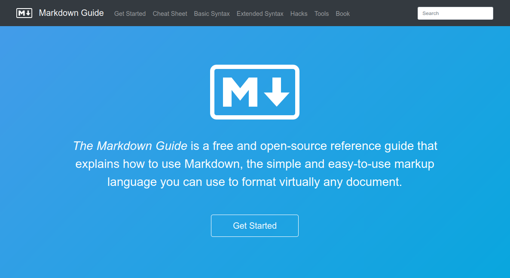

```{r setup, include=FALSE}
knitr::opts_chunk$set(echo = TRUE)
library(htmltools)
library(emoji)
library(knitr)

```

```{css firstpagebg, echo=FALSE}
.title-slide {
  background-image: url('assets/sharon-mccutcheon-576867-unsplash.jpg');
  background-size: cover;
  background-position: center;
  background-blend-mode: lighten;
}
```


## Exemple simple : rmd en pdf 

```{r, echo=FALSE}
tmp_files <- tempfile(fileext = c(".md", ".html"))
names(tmp_files) <- c("md", "html")
tmp_files <- as.list(tmp_files)

writeLines(
  c(
    "~~~~~~markdown",
    paste0(readLines("simple.Rmd")),
    "~~~~~~"
  ),
  con = tmp_files$md
)

rmarkdown::pandoc_convert(
  input = tmp_files$md, 
  to = "html5", 
  output = tmp_files$html,
  options = c("-s",  '-M',  'title=Fichier source (.rmd) :'  ,'-M', 'lang="fr"')
)

srcdoc <- paste(readLines(tmp_files$html), collapse = "\n")

div(class = "columns-2",  

    tags$embed(src= "simple.pdf", type="application/pdf", width="100%", height="500px"),
        div(tag("iframe", list(srcdoc = srcdoc, style = 'height:500px!important;'))

  )
)
```

# Rmarkdown avec Rstudio

## Prise en main facile avec RStudio

Menu `File > New File > R Markdown...`

```{r  include = TRUE, eval = TRUE, echo = FALSE, fig.align='center', out.width="60%"}
include_graphics("img/create_rmd.png")
```


## Enregistrer le fichier .rmd crée

```{r  include = TRUE, eval = TRUE, echo = FALSE, fig.align='center', out.width="100%"}

```

## Compiler (*knit*) un Rmarkdown

```{r  include = TRUE, eval = TRUE, echo = FALSE, fig.align='center', out.width="100%"}
include_graphics("img/knit2.png")
```


## Fichier généré (exemple HTML) 

<iframe src="mon_premier_rmarkdown.html"></iframe>


# Comment cela fonctionne ?

##  `r emoji('knit')` Tricot d'un Rmarkdown ?

```{r include = TRUE, eval = TRUE, echo = FALSE, fig.align='center', out.width="100%"}
include_graphics("img/schema_rmd.png")
```

<font size="4">Pandoc est généralement pré-installé sur les systèmes d'exploitation MACOS et Windows.</font>    
<font size="4">Si vous n'avez pas $\LaTeX$ d'installé, utilisez le package [`tinytex`](https://cran.r-project.org/package=tinytex) pour la compilation en pdf.</font>


## Les 3 composants d'un rmd

```{r include = TRUE, eval = TRUE, echo = FALSE, fig.align='center', out.width="100%"}
include_graphics("img/rmardown.PNG")
```

## Les 3 composants d'un rmd

- **En-tête `YAML`** : indications de variables pour la compilation du document : métadonnées (titre, auteur, date...), type de document souhaité (format et template), options de mise en page (TOC, Bibliographie, CSS...).    
<font size="4">Documentation &rarr; [***R Markdown: The Definitive Guide***](https://bookdown.org/yihui/rmarkdown/html-document.html).</font>  

- **Texte balisé en `Markdown`** : texte en langage naturel mis forme grâce à la syntaxe markdown.    
<font size="4">Documentation &rarr; [***Learn X in Y minutes***](https://learnxinyminutes.com/docs/markdown/)</font>  

- **_Chunks_** : code qui sera affiché (ou pas) et dont le résultat sera inséré (ou pas) dans le document final. Plusieurs options permettent de gérer l'éxécution,  l'affichage du code et de résultats.   
<font size="4">Documentation &rarr; [***Chunk options and package options***](https://yihui.org/knitr/options/)</font>  


## A. En-tête du document (`YAML`)

```yaml
---
title: Programmation lettrée et Notebook
author: Marc Done
date: `r Sys.Date()`
output: 
  ioslides_presentation:
    transition: slower
    incremental: true
    widescreen: true
    logo: img/rmarkdown.png
---
```

<font size="4">**De nombreuses variables sont paramétrables**. Certaines sont spécifiques à des formats de sortie ou à des templates. Mais, dans tous les cas :</font>

[`r fontawesome::fa('exclamation-triangle')` **L'indentation des variables doit être parfaite !**]{}


## Multiplier les formats de sortie ?

La variable `output` vous offre la possibilité de produire plusieurs formats à partir du même fichier Rmd : 

```yaml
---
title: Programmation lettrée et Notebook
author: Marc Done
date: `r Sys.Date()`
output: 
  html_document: default
  pdf_document: default
---
```

*Kniter* votre fichier en ligne de commande de la façon suivante :

```r
rmarkdown::render("mon_premier_rmarkdown.Rmd", output_format = "all")
```

## Les *templates* disponibles

<font size="5"> **De nombreux packages fournissent des modèles de mise en page prêts à l'emploi** :</font> 

<font size="4">`bookdown`, `distill`, `flexdashboard`, `hrbrthemes`, `komadown`, `komaletter`, `learnr`, `linl`, `memor`, `pagedown`, `papaja`, `pinp`, `prettydoc`, `radix`, `revealjs`, `rmarkdown`, `rmdformats`, `rmdshower`, `rticles`, `rzine`, `tufte`, `unilur`, `vitae`, `xaringan`...</font> 

<font size="5">Ils permettent de produire des documents de toute forme, comme :</font> 

<font size="4">
- des documents (pages) HTML,    
- des documents paginés (articles, livres, thèses) en pdf avec $\LaTeX$, docx, odt...,    
- des présentations/diaporama en format HTML, pdf ou pptx,    
- des tableaux de bord interactif,   
- des cours et sujets d'examens (interactif ou non),   
- et même des sites internet statiques !   
</font>


## Ex : `rmdformats` - modèle `readthedown`

```yaml
---
title: "Template readthedown proposé par le package rmdformats"
date: "`r Sys.Date()`"
output:
  rmdformats::readthedown:
    highlight: kate
---
```

</br>

L'interface Rstudio permet de générer un rmd paramétré dans un modèle de mise en page souhaité. Pour cela, installer le package qui fournit le template que vous souhaitez utiliser. Ex :

```r
install.packages("rmdformats")
```


## Exemple `rmdformats`

Une fois installé, les templates proposés par le package installés sont disponibles en clic-buton dans Rstudio :

```{r include = TRUE, eval = TRUE, echo = FALSE, fig.align='center', out.width="60%"}
include_graphics("img/rmdformats.png")
```


## Ajouter ses variables... modulables !

Pour produire des rapports sur différentes périodes, zones géographiques... A partir du même fichier R Markdown ! 

```yaml
---
title: Rapport statistique IDH
output: html_document
params:
  annee: 2023
  region: Europe
---
```

</br>

*Kniter* votre fichier en ligne de commande de la façon suivante :

```r
rmarkdown::render("monfichier.Rmd", params = list(annee = 2013, region = Asie))
```

## Ajouter ses variables... modulables !

Cette fonctionnalité est aussi disponible en clic-bouton via l'interface Rstudio :

::: {.columns-2}

\

```{r include = TRUE, eval = TRUE, echo = FALSE, fig.align='center', out.width="30%"}

```


```{r include = TRUE, eval = TRUE, echo = FALSE, fig.align='center', out.width="60%"}

```


```{r include = TRUE, eval = TRUE, echo = FALSE, fig.align='center', out.width="100%"}
include_graphics("img/params2.png")
```

:::


## B. Zone de texte - balisage `markdown`


```{r include = TRUE, eval = TRUE, echo = FALSE, fig.align='center', out.width="100%"}

```

[https://www.markdownguide.org/]{.linkcenter}

```{css, echo=FALSE}
.linkcenter {
  font-size: 60%;
}
```


## C. Bloc de code - *chunks*

Deux façons d'insérer du code dans son document :

1. **Code chunk**  

    ````r
    `r ''````{r, eval=TRUE, echo=FALSE}
    
    head(mtcars)
    
    ```
    ````
    
    
2. **Inline code**, pour inclure du code dans une zone de texte

    ````markdown
    La moyenne est de `r '\x60r mean(mtcars$cyl)\x60'`.
    ````

## Les [options disponibles](https://yihui.name/knitr/options/)


```{r include = TRUE, eval = TRUE, echo = FALSE, fig.align='center', out.width="65%"}
include_graphics("img/chunk_params.jpg")
```


## *chunk* plurilingues

```{r}
names(knitr::knit_engines$get())
```


## Ex : `python` et le package `reticulate` {.smaller}

```{r, include=FALSE, eval=FALSE}
library(reticulate)
use_python("usr/local/bin/python")
use_virtualenv("r-reticulate")
py_install(c("pandas", "numpy"))
```

1. Initialisation de la configuration

    ````r
    `r ''````{r, include = FALSE, eval = TRUE}
    library(reticulate)
    use_python("usr/local/bin/python")
    use_virtualenv("r-reticulate")
    py_install(c("pandas", "numpy"))
    ```
    ````

1. Script python

    ````py
    `r ''````{python, eval = TRUE}
    a = 15 + 45
    print(a)
    ```
    ````

    ```{python, echo = FALSE}
    a = 15 + 45
    print(a)
    ```


## Exemple : `SQL` avec scripts externes

```{r, echo=FALSE}
conn <- DBI::dbConnect(RSQLite::SQLite(), path = ":memory:")
DBI::dbWriteTable(conn, "mtcars", mtcars)
```

**Etape 1 : connexion à la base de données**  
````r
`r ''````{r , eval = TRUE}
conn <- DBI::dbConnect(RSQLite::SQLite(), path = ":memory:")
```
````

\

**Pour se déconnecter (en fin de document) :**  
````r
`r ''````{r , eval = TRUE}
DBI::dbDisconnect(conn)
```
````

---

**Etape 2 : Lecture et éxécution d'un fichier sql** 


````markdown
`r ''````{sql, connection=conn, code=readLines('sql/list_tables.sql')}

```
````

```{sql, connection=conn, code=readLines('sql/list_tables.sql')}
```


```{r, eval=TRUE, echo =FALSE}
DBI::dbDisconnect(conn)
```


## Ex : `node.js` avec un script externe {.smaller}

Vous voulez présenter du code `node.js`.  
Vos scripts sont dans des fichiers `.js`.

Vous pouvez écrire :

````markdown
`r ''````{node, code=readLines('node/example.js')}
```
````

```{node, code=readLines('node/example.js'), eval=FALSE}
```


# Un peu de documentation ?


## Cheatsheet Rmarkdown

[[R Markdown Cheat Sheet](https://posit.co/wp-content/uploads/2022/10/rmarkdown-1.pdf) par [RStudio](https://www.rstudio.com/), licence [CC BY 4.0](https://creativecommons.org/licenses/by/4.0/)]{.license}

<iframe src="https://posit.co/wp-content/uploads/2022/10/rmarkdown-1.pdf"></iframe>

```{css, echo=FALSE}
.license {
  font-size: 70%;
  position: absolute;
  top: 100px;
}
```


## Bibliographie


**Les références :**

- [Xie, Y., J.J. Allaire et G. Grolemund [_R Markdown: The Definitive Guide_](https://bookdown.org/yihui/rmarkdown/)]{.reference}   
- [Xie Yihui, [_`knitr` Elegant, flexible, and fast dynamic report generation with R_](https://yihui.name/knitr/)]{.reference}   
- [Xie, Y., C. Dervieux et E. Riederer [_R Markdown Cookbook_](https://bookdown.org/yihui/rmarkdown-cookbook/)]{.reference}   
- [Xie Yihui, [_bookdown: Authoring Books and Technical Documents with R Markdown_](https://bookdown.org/yihui/bookdown/)]{.reference}   

\

**En français :**

- [Julien Barnier, [_Introduction à R et au tidyverse - Diffuser et publier avec rmarkdown_](https://juba.github.io/tidyverse/13-rmarkdown.html)]{.reference}
- [Lino Galiana et al. (INSEE), [_Utilitaire - Produire des documents avec R Markdown_](https://www.book.utilitr.org/03_fiches_thematiques/fiche_rmarkdown)]{.reference}


```{css, echo=FALSE}
.reference {
  font-size: 76%;
}
```


## Crédits

Cette présentation est fortement inspirée d'un excellent support de communication existant, dont le code source est [disponible sur GitHub](https://github.com/RLesur/meetup-r-nantes-rmd).

- [Romain Lesur, [_Créez vos documents avec Rmarkdown_](https://rlesur.github.io/meetup-r-nantes-rmd/#1), Janvier 2019, Nantes]{.reference}


\

Il s'agit d'un document Rmarkdown au format ***ioslides***. Il a donc été très simple de repartir du code source original pour produire ce diaporama !


# À vous de jouer !


<!-- ## Le fonctionnement de R Markdown -->

<!-- Le package `rmarkdown` assure la bonne exécution des étapes suivantes : -->

<!-- - fichier `.Rmd`  fichier `.md` = `knitr`   -->
<!--   Exécution des chunks et insertion du résultat -->

<!-- - fichier `.md`  fichier `.html` ou `.tex`, `.docx`, `.odt`... = **Pandoc** -->

<!-- Pour les pdf avec $\LaTeX$, étape supplémentaire : -->

<!-- - fichier `.tex`  fichier `.pdf` = $\LaTeX$  -->

