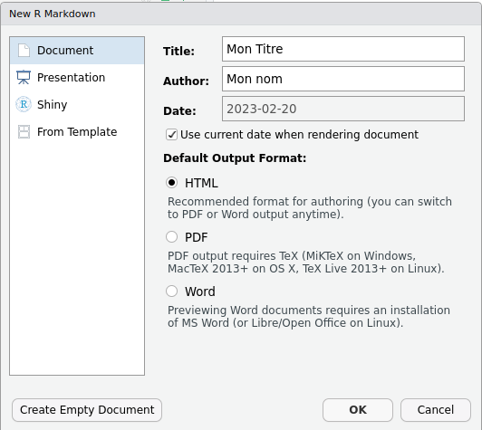
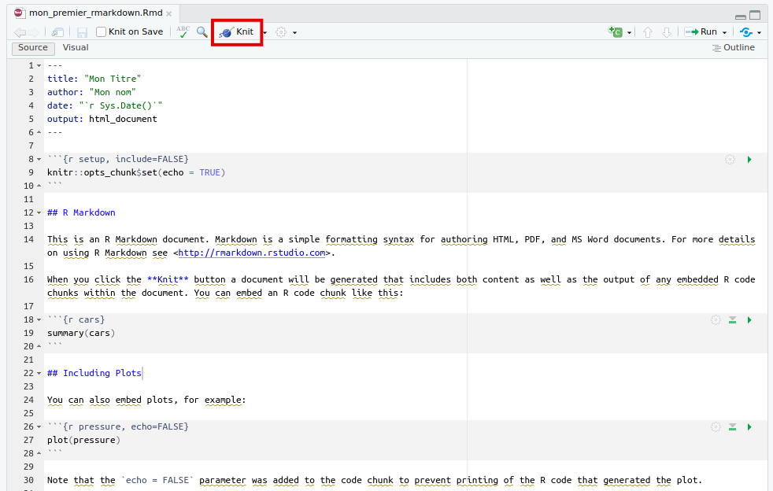
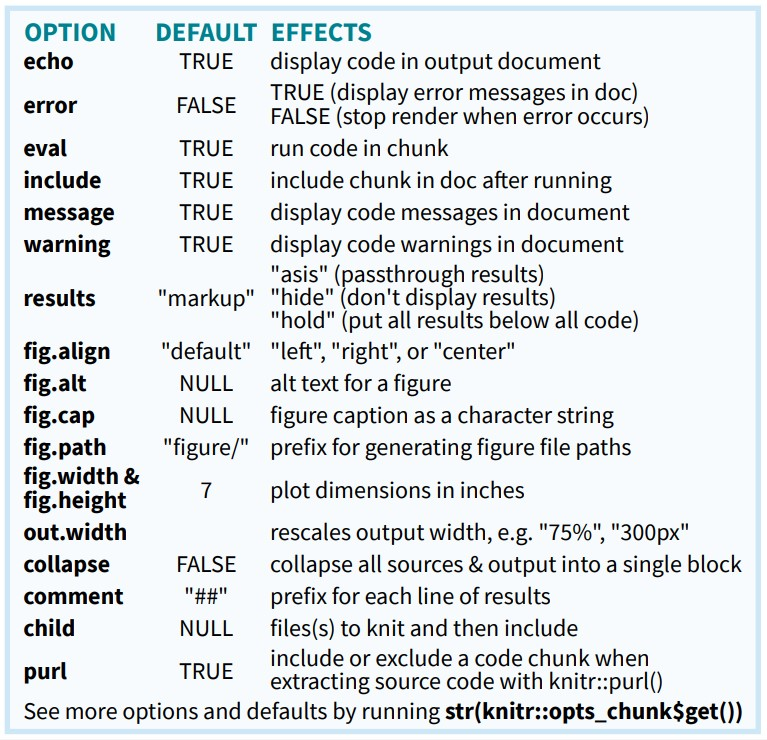

<style type="text/css">
.title-slide {
  background-image: url('assets/sharon-mccutcheon-576867-unsplash.jpg');
  background-size: cover;
  background-position: center;
  background-blend-mode: lighten;
}
</style>


## Exemple simple : rmd en pdf 


```{=html}
<div class="columns-2">
<embed src="simple.pdf" type="application/pdf" width="100%" height="500px"/>
<div>
<iframe srcdoc="&lt;!DOCTYPE html&gt;&#10;&lt;html xmlns=&quot;http://www.w3.org/1999/xhtml&quot; lang=&quot;fr&quot; xml:lang=&quot;fr&quot;&gt;&#10;&lt;head&gt;&#10;  &lt;meta charset=&quot;utf-8&quot; /&gt;&#10;  &lt;meta name=&quot;generator&quot; content=&quot;pandoc&quot; /&gt;&#10;  &lt;meta name=&quot;viewport&quot; content=&quot;width=device-width, initial-scale=1.0, user-scalable=yes&quot; /&gt;&#10;  &lt;title&gt;Fichier source (.rmd) :&lt;/title&gt;&#10;  &lt;style&gt;&#10;    html {&#10;      line-height: 1.5;&#10;      font-family: Georgia, serif;&#10;      font-size: 20px;&#10;      color: #1a1a1a;&#10;      background-color: #fdfdfd;&#10;    }&#10;    body {&#10;      margin: 0 auto;&#10;      max-width: 36em;&#10;      padding-left: 50px;&#10;      padding-right: 50px;&#10;      padding-top: 50px;&#10;      padding-bottom: 50px;&#10;      hyphens: auto;&#10;      overflow-wrap: break-word;&#10;      text-rendering: optimizeLegibility;&#10;      font-kerning: normal;&#10;    }&#10;    @media (max-width: 600px) {&#10;      body {&#10;        font-size: 0.9em;&#10;        padding: 1em;&#10;      }&#10;      h1 {&#10;        font-size: 1.8em;&#10;      }&#10;    }&#10;    @media print {&#10;      body {&#10;        background-color: transparent;&#10;        color: black;&#10;        font-size: 12pt;&#10;      }&#10;      p, h2, h3 {&#10;        orphans: 3;&#10;        widows: 3;&#10;      }&#10;      h2, h3, h4 {&#10;        page-break-after: avoid;&#10;      }&#10;    }&#10;    p {&#10;      margin: 1em 0;&#10;    }&#10;    a {&#10;      color: #1a1a1a;&#10;    }&#10;    a:visited {&#10;      color: #1a1a1a;&#10;    }&#10;    img {&#10;      max-width: 100%;&#10;    }&#10;    h1, h2, h3, h4, h5, h6 {&#10;      margin-top: 1.4em;&#10;    }&#10;    h5, h6 {&#10;      font-size: 1em;&#10;      font-style: italic;&#10;    }&#10;    h6 {&#10;      font-weight: normal;&#10;    }&#10;    ol, ul {&#10;      padding-left: 1.7em;&#10;      margin-top: 1em;&#10;    }&#10;    li &gt; ol, li &gt; ul {&#10;      margin-top: 0;&#10;    }&#10;    blockquote {&#10;      margin: 1em 0 1em 1.7em;&#10;      padding-left: 1em;&#10;      border-left: 2px solid #e6e6e6;&#10;      color: #606060;&#10;    }&#10;    code {&#10;      font-family: Menlo, Monaco, &#39;Lucida Console&#39;, Consolas, monospace;&#10;      font-size: 85%;&#10;      margin: 0;&#10;    }&#10;    pre {&#10;      margin: 1em 0;&#10;      overflow: auto;&#10;    }&#10;    pre code {&#10;      padding: 0;&#10;      overflow: visible;&#10;      overflow-wrap: normal;&#10;    }&#10;    .sourceCode {&#10;     background-color: transparent;&#10;     overflow: visible;&#10;    }&#10;    hr {&#10;      background-color: #1a1a1a;&#10;      border: none;&#10;      height: 1px;&#10;      margin: 1em 0;&#10;    }&#10;    table {&#10;      margin: 1em 0;&#10;      border-collapse: collapse;&#10;      width: 100%;&#10;      overflow-x: auto;&#10;      display: block;&#10;      font-variant-numeric: lining-nums tabular-nums;&#10;    }&#10;    table caption {&#10;      margin-bottom: 0.75em;&#10;    }&#10;    tbody {&#10;      margin-top: 0.5em;&#10;      border-top: 1px solid #1a1a1a;&#10;      border-bottom: 1px solid #1a1a1a;&#10;    }&#10;    th {&#10;      border-top: 1px solid #1a1a1a;&#10;      padding: 0.25em 0.5em 0.25em 0.5em;&#10;    }&#10;    td {&#10;      padding: 0.125em 0.5em 0.25em 0.5em;&#10;    }&#10;    header {&#10;      margin-bottom: 4em;&#10;      text-align: center;&#10;    }&#10;    #TOC li {&#10;      list-style: none;&#10;    }&#10;    #TOC ul {&#10;      padding-left: 1.3em;&#10;    }&#10;    #TOC &gt; ul {&#10;      padding-left: 0;&#10;    }&#10;    #TOC a:not(:hover) {&#10;      text-decoration: none;&#10;    }&#10;    code{white-space: pre-wrap;}&#10;    span.smallcaps{font-variant: small-caps;}&#10;    div.columns{display: flex; gap: min(4vw, 1.5em);}&#10;    div.column{flex: auto; overflow-x: auto;}&#10;    div.hanging-indent{margin-left: 1.5em; text-indent: -1.5em;}&#10;    ul.task-list{list-style: none;}&#10;    ul.task-list li input[type=&quot;checkbox&quot;] {&#10;      width: 0.8em;&#10;      margin: 0 0.8em 0.2em -1.6em;&#10;      vertical-align: middle;&#10;    }&#10;    pre &gt; code.sourceCode { white-space: pre; position: relative; }&#10;    pre &gt; code.sourceCode &gt; span { display: inline-block; line-height: 1.25; }&#10;    pre &gt; code.sourceCode &gt; span:empty { height: 1.2em; }&#10;    .sourceCode { overflow: visible; }&#10;    code.sourceCode &gt; span { color: inherit; text-decoration: inherit; }&#10;    div.sourceCode { margin: 1em 0; }&#10;    pre.sourceCode { margin: 0; }&#10;    @media screen {&#10;    div.sourceCode { overflow: auto; }&#10;    }&#10;    @media print {&#10;    pre &gt; code.sourceCode { white-space: pre-wrap; }&#10;    pre &gt; code.sourceCode &gt; span { text-indent: -5em; padding-left: 5em; }&#10;    }&#10;    pre.numberSource code&#10;      { counter-reset: source-line 0; }&#10;    pre.numberSource code &gt; span&#10;      { position: relative; left: -4em; counter-increment: source-line; }&#10;    pre.numberSource code &gt; span &gt; a:first-child::before&#10;      { content: counter(source-line);&#10;        position: relative; left: -1em; text-align: right; vertical-align: baseline;&#10;        border: none; display: inline-block;&#10;        -webkit-touch-callout: none; -webkit-user-select: none;&#10;        -khtml-user-select: none; -moz-user-select: none;&#10;        -ms-user-select: none; user-select: none;&#10;        padding: 0 4px; width: 4em;&#10;        color: #aaaaaa;&#10;      }&#10;    pre.numberSource { margin-left: 3em; border-left: 1px solid #aaaaaa;  padding-left: 4px; }&#10;    div.sourceCode&#10;      {   }&#10;    @media screen {&#10;    pre &gt; code.sourceCode &gt; span &gt; a:first-child::before { text-decoration: underline; }&#10;    }&#10;    code span.al { color: #ff0000; font-weight: bold; } /* Alert */&#10;    code span.an { color: #60a0b0; font-weight: bold; font-style: italic; } /* Annotation */&#10;    code span.at { color: #7d9029; } /* Attribute */&#10;    code span.bn { color: #40a070; } /* BaseN */&#10;    code span.bu { color: #008000; } /* BuiltIn */&#10;    code span.cf { color: #007020; font-weight: bold; } /* ControlFlow */&#10;    code span.ch { color: #4070a0; } /* Char */&#10;    code span.cn { color: #880000; } /* Constant */&#10;    code span.co { color: #60a0b0; font-style: italic; } /* Comment */&#10;    code span.cv { color: #60a0b0; font-weight: bold; font-style: italic; } /* CommentVar */&#10;    code span.do { color: #ba2121; font-style: italic; } /* Documentation */&#10;    code span.dt { color: #902000; } /* DataType */&#10;    code span.dv { color: #40a070; } /* DecVal */&#10;    code span.er { color: #ff0000; font-weight: bold; } /* Error */&#10;    code span.ex { } /* Extension */&#10;    code span.fl { color: #40a070; } /* Float */&#10;    code span.fu { color: #06287e; } /* Function */&#10;    code span.im { color: #008000; font-weight: bold; } /* Import */&#10;    code span.in { color: #60a0b0; font-weight: bold; font-style: italic; } /* Information */&#10;    code span.kw { color: #007020; font-weight: bold; } /* Keyword */&#10;    code span.op { color: #666666; } /* Operator */&#10;    code span.ot { color: #007020; } /* Other */&#10;    code span.pp { color: #bc7a00; } /* Preprocessor */&#10;    code span.sc { color: #4070a0; } /* SpecialChar */&#10;    code span.ss { color: #bb6688; } /* SpecialString */&#10;    code span.st { color: #4070a0; } /* String */&#10;    code span.va { color: #19177c; } /* Variable */&#10;    code span.vs { color: #4070a0; } /* VerbatimString */&#10;    code span.wa { color: #60a0b0; font-weight: bold; font-style: italic; } /* Warning */&#10;    .display.math{display: block; text-align: center; margin: 0.5rem auto;}&#10;  &lt;/style&gt;&#10;  &lt;!--[if lt IE 9]&gt;&#10;    &lt;script src=&quot;//cdnjs.cloudflare.com/ajax/libs/html5shiv/3.7.3/html5shiv-printshiv.min.js&quot;&gt;&lt;/script&gt;&#10;  &lt;![endif]--&gt;&#10;&lt;/head&gt;&#10;&lt;body&gt;&#10;&lt;header id=&quot;title-block-header&quot;&gt;&#10;&lt;h1 class=&quot;title&quot;&gt;Fichier source (.rmd) :&lt;/h1&gt;&#10;&lt;/header&gt;&#10;&lt;div class=&quot;sourceCode&quot; id=&quot;cb1&quot;&gt;&lt;pre&#10;class=&quot;sourceCode markdown&quot;&gt;&lt;code class=&quot;sourceCode markdown&quot;&gt;&lt;span id=&quot;cb1-1&quot;&gt;&lt;a href=&quot;#cb1-1&quot; aria-hidden=&quot;true&quot; tabindex=&quot;-1&quot;&gt;&lt;/a&gt;&lt;span class=&quot;co&quot;&gt;---&lt;/span&gt;&lt;/span&gt;&#10;&lt;span id=&quot;cb1-2&quot;&gt;&lt;a href=&quot;#cb1-2&quot; aria-hidden=&quot;true&quot; tabindex=&quot;-1&quot;&gt;&lt;/a&gt;&lt;span class=&quot;an&quot;&gt;title:&lt;/span&gt;&lt;span class=&quot;co&quot;&gt; &amp;quot;Mon module de cours&amp;quot;&lt;/span&gt;&lt;/span&gt;&#10;&lt;span id=&quot;cb1-3&quot;&gt;&lt;a href=&quot;#cb1-3&quot; aria-hidden=&quot;true&quot; tabindex=&quot;-1&quot;&gt;&lt;/a&gt;&lt;span class=&quot;an&quot;&gt;author:&lt;/span&gt;&lt;span class=&quot;co&quot;&gt; &amp;quot;Marc Done&amp;quot;&lt;/span&gt;&lt;/span&gt;&#10;&lt;span id=&quot;cb1-4&quot;&gt;&lt;a href=&quot;#cb1-4&quot; aria-hidden=&quot;true&quot; tabindex=&quot;-1&quot;&gt;&lt;/a&gt;&lt;span class=&quot;an&quot;&gt;date:&lt;/span&gt;&lt;span class=&quot;co&quot;&gt; &amp;quot;29/03/2023&amp;quot;&lt;/span&gt;&lt;/span&gt;&#10;&lt;span id=&quot;cb1-5&quot;&gt;&lt;a href=&quot;#cb1-5&quot; aria-hidden=&quot;true&quot; tabindex=&quot;-1&quot;&gt;&lt;/a&gt;&lt;span class=&quot;an&quot;&gt;output:&lt;/span&gt;&lt;span class=&quot;co&quot;&gt; &lt;/span&gt;&lt;/span&gt;&#10;&lt;span id=&quot;cb1-6&quot;&gt;&lt;a href=&quot;#cb1-6&quot; aria-hidden=&quot;true&quot; tabindex=&quot;-1&quot;&gt;&lt;/a&gt;&lt;span class=&quot;co&quot;&gt;  pdf_document:&lt;/span&gt;&lt;/span&gt;&#10;&lt;span id=&quot;cb1-7&quot;&gt;&lt;a href=&quot;#cb1-7&quot; aria-hidden=&quot;true&quot; tabindex=&quot;-1&quot;&gt;&lt;/a&gt;&lt;span class=&quot;co&quot;&gt;    df_print: kable&lt;/span&gt;&lt;/span&gt;&#10;&lt;span id=&quot;cb1-8&quot;&gt;&lt;a href=&quot;#cb1-8&quot; aria-hidden=&quot;true&quot; tabindex=&quot;-1&quot;&gt;&lt;/a&gt;&lt;span class=&quot;co&quot;&gt;---&lt;/span&gt;&lt;/span&gt;&#10;&lt;span id=&quot;cb1-9&quot;&gt;&lt;a href=&quot;#cb1-9&quot; aria-hidden=&quot;true&quot; tabindex=&quot;-1&quot;&gt;&lt;/a&gt;&lt;/span&gt;&#10;&lt;span id=&quot;cb1-10&quot;&gt;&lt;a href=&quot;#cb1-10&quot; aria-hidden=&quot;true&quot; tabindex=&quot;-1&quot;&gt;&lt;/a&gt;&lt;/span&gt;&#10;&lt;span id=&quot;cb1-11&quot;&gt;&lt;a href=&quot;#cb1-11&quot; aria-hidden=&quot;true&quot; tabindex=&quot;-1&quot;&gt;&lt;/a&gt;&lt;span class=&quot;fu&quot;&gt;## Introduction&lt;/span&gt;&lt;/span&gt;&#10;&lt;span id=&quot;cb1-12&quot;&gt;&lt;a href=&quot;#cb1-12&quot; aria-hidden=&quot;true&quot; tabindex=&quot;-1&quot;&gt;&lt;/a&gt;&lt;/span&gt;&#10;&lt;span id=&quot;cb1-13&quot;&gt;&lt;a href=&quot;#cb1-13&quot; aria-hidden=&quot;true&quot; tabindex=&quot;-1&quot;&gt;&lt;/a&gt;Quelques mots sur les **objectifs de ce cours** et les données utilisées.&lt;/span&gt;&#10;&lt;span id=&quot;cb1-14&quot;&gt;&lt;a href=&quot;#cb1-14&quot; aria-hidden=&quot;true&quot; tabindex=&quot;-1&quot;&gt;&lt;/a&gt;&lt;/span&gt;&#10;&lt;span id=&quot;cb1-15&quot;&gt;&lt;a href=&quot;#cb1-15&quot; aria-hidden=&quot;true&quot; tabindex=&quot;-1&quot;&gt;&lt;/a&gt;&lt;span class=&quot;fu&quot;&gt;## Du texte et un graphique&lt;/span&gt;&lt;/span&gt;&#10;&lt;span id=&quot;cb1-16&quot;&gt;&lt;a href=&quot;#cb1-16&quot; aria-hidden=&quot;true&quot; tabindex=&quot;-1&quot;&gt;&lt;/a&gt;&lt;/span&gt;&#10;&lt;span id=&quot;cb1-17&quot;&gt;&lt;a href=&quot;#cb1-17&quot; aria-hidden=&quot;true&quot; tabindex=&quot;-1&quot;&gt;&lt;/a&gt;Lorem ipsum dolor sit amet, consectetur adipiscing elit. Maecenas euismod, dolor at faucibus finibus, lacus nunc gravida mauris, ac porttitor felis turpis a purus. Mauris aliquam risus ut erat accumsan, id gravida purus dignissim. Donec tortor est, fringilla sit amet magna at, mattis pulvinar erat. Aenean tellus ante, rutrum non purus eu, commodo vehicula leo. Mauris congue urna nec tristique eleifend. Sed tincidunt vel justo id pellentesque. Proin sagittis fermentum tellus, eu viverra neque eleifend at. Suspendisse potenti.&lt;/span&gt;&#10;&lt;span id=&quot;cb1-18&quot;&gt;&lt;a href=&quot;#cb1-18&quot; aria-hidden=&quot;true&quot; tabindex=&quot;-1&quot;&gt;&lt;/a&gt;&lt;/span&gt;&#10;&lt;span id=&quot;cb1-19&quot;&gt;&lt;a href=&quot;#cb1-19&quot; aria-hidden=&quot;true&quot; tabindex=&quot;-1&quot;&gt;&lt;/a&gt;Source du graphique : http://r-statistics.co/Top50-Ggplot2-Visualizations-MasterList-R-Code.html&lt;/span&gt;&#10;&lt;span id=&quot;cb1-20&quot;&gt;&lt;a href=&quot;#cb1-20&quot; aria-hidden=&quot;true&quot; tabindex=&quot;-1&quot;&gt;&lt;/a&gt;&lt;/span&gt;&#10;&lt;span id=&quot;cb1-21&quot;&gt;&lt;a href=&quot;#cb1-21&quot; aria-hidden=&quot;true&quot; tabindex=&quot;-1&quot;&gt;&lt;/a&gt;&lt;span class=&quot;in&quot;&gt;```{r graphique, eval = TRUE, echo = TRUE, message = FALSE, fig.height=4}&lt;/span&gt;&lt;/span&gt;&#10;&lt;span id=&quot;cb1-22&quot;&gt;&lt;a href=&quot;#cb1-22&quot; aria-hidden=&quot;true&quot; tabindex=&quot;-1&quot;&gt;&lt;/a&gt;&lt;span class=&quot;in&quot;&gt;library(ggplot2)&lt;/span&gt;&lt;/span&gt;&#10;&lt;span id=&quot;cb1-23&quot;&gt;&lt;a href=&quot;#cb1-23&quot; aria-hidden=&quot;true&quot; tabindex=&quot;-1&quot;&gt;&lt;/a&gt;&lt;span class=&quot;in&quot;&gt;library(quantmod)&lt;/span&gt;&lt;/span&gt;&#10;&lt;span id=&quot;cb1-24&quot;&gt;&lt;a href=&quot;#cb1-24&quot; aria-hidden=&quot;true&quot; tabindex=&quot;-1&quot;&gt;&lt;/a&gt;&lt;span class=&quot;in&quot;&gt;data(&amp;quot;economics&amp;quot;, package = &amp;quot;ggplot2&amp;quot;)&lt;/span&gt;&lt;/span&gt;&#10;&lt;span id=&quot;cb1-25&quot;&gt;&lt;a href=&quot;#cb1-25&quot; aria-hidden=&quot;true&quot; tabindex=&quot;-1&quot;&gt;&lt;/a&gt;&lt;/span&gt;&#10;&lt;span id=&quot;cb1-26&quot;&gt;&lt;a href=&quot;#cb1-26&quot; aria-hidden=&quot;true&quot; tabindex=&quot;-1&quot;&gt;&lt;/a&gt;&lt;span class=&quot;in&quot;&gt;# Compute % Returns&lt;/span&gt;&lt;/span&gt;&#10;&lt;span id=&quot;cb1-27&quot;&gt;&lt;a href=&quot;#cb1-27&quot; aria-hidden=&quot;true&quot; tabindex=&quot;-1&quot;&gt;&lt;/a&gt;&lt;span class=&quot;in&quot;&gt;economics$returns_perc &amp;lt;- c(0, diff(economics$psavert)/economics$psavert[-length(economics$psavert)])&lt;/span&gt;&lt;/span&gt;&#10;&lt;span id=&quot;cb1-28&quot;&gt;&lt;a href=&quot;#cb1-28&quot; aria-hidden=&quot;true&quot; tabindex=&quot;-1&quot;&gt;&lt;/a&gt;&lt;/span&gt;&#10;&lt;span id=&quot;cb1-29&quot;&gt;&lt;a href=&quot;#cb1-29&quot; aria-hidden=&quot;true&quot; tabindex=&quot;-1&quot;&gt;&lt;/a&gt;&lt;span class=&quot;in&quot;&gt;# Create break points and labels for axis ticks&lt;/span&gt;&lt;/span&gt;&#10;&lt;span id=&quot;cb1-30&quot;&gt;&lt;a href=&quot;#cb1-30&quot; aria-hidden=&quot;true&quot; tabindex=&quot;-1&quot;&gt;&lt;/a&gt;&lt;span class=&quot;in&quot;&gt;brks &amp;lt;- economics$date[seq(1, length(economics$date), 12)]&lt;/span&gt;&lt;/span&gt;&#10;&lt;span id=&quot;cb1-31&quot;&gt;&lt;a href=&quot;#cb1-31&quot; aria-hidden=&quot;true&quot; tabindex=&quot;-1&quot;&gt;&lt;/a&gt;&lt;span class=&quot;in&quot;&gt;lbls &amp;lt;- lubridate::year(economics$date[seq(1, length(economics$date), 12)])&lt;/span&gt;&lt;/span&gt;&#10;&lt;span id=&quot;cb1-32&quot;&gt;&lt;a href=&quot;#cb1-32&quot; aria-hidden=&quot;true&quot; tabindex=&quot;-1&quot;&gt;&lt;/a&gt;&lt;/span&gt;&#10;&lt;span id=&quot;cb1-33&quot;&gt;&lt;a href=&quot;#cb1-33&quot; aria-hidden=&quot;true&quot; tabindex=&quot;-1&quot;&gt;&lt;/a&gt;&lt;span class=&quot;in&quot;&gt;# Plot&lt;/span&gt;&lt;/span&gt;&#10;&lt;span id=&quot;cb1-34&quot;&gt;&lt;a href=&quot;#cb1-34&quot; aria-hidden=&quot;true&quot; tabindex=&quot;-1&quot;&gt;&lt;/a&gt;&lt;span class=&quot;in&quot;&gt;ggplot(economics[1:100, ], aes(date, returns_perc)) + &lt;/span&gt;&lt;/span&gt;&#10;&lt;span id=&quot;cb1-35&quot;&gt;&lt;a href=&quot;#cb1-35&quot; aria-hidden=&quot;true&quot; tabindex=&quot;-1&quot;&gt;&lt;/a&gt;&lt;span class=&quot;in&quot;&gt;  geom_area() + &lt;/span&gt;&lt;/span&gt;&#10;&lt;span id=&quot;cb1-36&quot;&gt;&lt;a href=&quot;#cb1-36&quot; aria-hidden=&quot;true&quot; tabindex=&quot;-1&quot;&gt;&lt;/a&gt;&lt;span class=&quot;in&quot;&gt;  scale_x_date(breaks=brks, labels=lbls) + &lt;/span&gt;&lt;/span&gt;&#10;&lt;span id=&quot;cb1-37&quot;&gt;&lt;a href=&quot;#cb1-37&quot; aria-hidden=&quot;true&quot; tabindex=&quot;-1&quot;&gt;&lt;/a&gt;&lt;span class=&quot;in&quot;&gt;  theme(axis.text.x = element_text(angle=90)) + &lt;/span&gt;&lt;/span&gt;&#10;&lt;span id=&quot;cb1-38&quot;&gt;&lt;a href=&quot;#cb1-38&quot; aria-hidden=&quot;true&quot; tabindex=&quot;-1&quot;&gt;&lt;/a&gt;&lt;span class=&quot;in&quot;&gt;  labs(title=&amp;quot;Area Chart&amp;quot;, &lt;/span&gt;&lt;/span&gt;&#10;&lt;span id=&quot;cb1-39&quot;&gt;&lt;a href=&quot;#cb1-39&quot; aria-hidden=&quot;true&quot; tabindex=&quot;-1&quot;&gt;&lt;/a&gt;&lt;span class=&quot;in&quot;&gt;       subtitle = &amp;quot;Perc Returns for Personal Savings&amp;quot;, &lt;/span&gt;&lt;/span&gt;&#10;&lt;span id=&quot;cb1-40&quot;&gt;&lt;a href=&quot;#cb1-40&quot; aria-hidden=&quot;true&quot; tabindex=&quot;-1&quot;&gt;&lt;/a&gt;&lt;span class=&quot;in&quot;&gt;       y=&amp;quot;% Returns for Personal savings&amp;quot;, &lt;/span&gt;&lt;/span&gt;&#10;&lt;span id=&quot;cb1-41&quot;&gt;&lt;a href=&quot;#cb1-41&quot; aria-hidden=&quot;true&quot; tabindex=&quot;-1&quot;&gt;&lt;/a&gt;&lt;span class=&quot;in&quot;&gt;       caption=&amp;quot;Source: economics&amp;quot;)&lt;/span&gt;&lt;/span&gt;&#10;&lt;span id=&quot;cb1-42&quot;&gt;&lt;a href=&quot;#cb1-42&quot; aria-hidden=&quot;true&quot; tabindex=&quot;-1&quot;&gt;&lt;/a&gt;&lt;span class=&quot;in&quot;&gt;```&lt;/span&gt;&lt;/span&gt;&#10;&lt;span id=&quot;cb1-43&quot;&gt;&lt;a href=&quot;#cb1-43&quot; aria-hidden=&quot;true&quot; tabindex=&quot;-1&quot;&gt;&lt;/a&gt;&lt;/span&gt;&#10;&lt;span id=&quot;cb1-44&quot;&gt;&lt;a href=&quot;#cb1-44&quot; aria-hidden=&quot;true&quot; tabindex=&quot;-1&quot;&gt;&lt;/a&gt;&lt;span class=&quot;fu&quot;&gt;## Un tableau avec quelques données&lt;/span&gt;&lt;/span&gt;&#10;&lt;span id=&quot;cb1-45&quot;&gt;&lt;a href=&quot;#cb1-45&quot; aria-hidden=&quot;true&quot; tabindex=&quot;-1&quot;&gt;&lt;/a&gt;&lt;/span&gt;&#10;&lt;span id=&quot;cb1-46&quot;&gt;&lt;a href=&quot;#cb1-46&quot; aria-hidden=&quot;true&quot; tabindex=&quot;-1&quot;&gt;&lt;/a&gt;Voici un petit tableau :&lt;/span&gt;&#10;&lt;span id=&quot;cb1-47&quot;&gt;&lt;a href=&quot;#cb1-47&quot; aria-hidden=&quot;true&quot; tabindex=&quot;-1&quot;&gt;&lt;/a&gt;&lt;/span&gt;&#10;&lt;span id=&quot;cb1-48&quot;&gt;&lt;a href=&quot;#cb1-48&quot; aria-hidden=&quot;true&quot; tabindex=&quot;-1&quot;&gt;&lt;/a&gt;&lt;span class=&quot;in&quot;&gt;```{r tableau}&lt;/span&gt;&lt;/span&gt;&#10;&lt;span id=&quot;cb1-49&quot;&gt;&lt;a href=&quot;#cb1-49&quot; aria-hidden=&quot;true&quot; tabindex=&quot;-1&quot;&gt;&lt;/a&gt;&lt;span class=&quot;in&quot;&gt;head(economics, n = 3L)&lt;/span&gt;&lt;/span&gt;&#10;&lt;span id=&quot;cb1-50&quot;&gt;&lt;a href=&quot;#cb1-50&quot; aria-hidden=&quot;true&quot; tabindex=&quot;-1&quot;&gt;&lt;/a&gt;&lt;span class=&quot;in&quot;&gt;```&lt;/span&gt;&lt;/span&gt;&lt;/code&gt;&lt;/pre&gt;&lt;/div&gt;&#10;&lt;/body&gt;&#10;&lt;/html&gt;" style="height:500px!important;"></iframe>
</div>
</div>
```

## Prise en main facile avec RStudio

Menu `File > New File > R Markdown...`




## Enregistrer le fichier .rmd crée


## Compiler (*knit*) un Rmarkdown




## Fichier généré (exemple HTML) 

<iframe src="mon_premier_rmarkdown.html"></iframe>


##  🧶 Tricot d'un Rmarkdown ?


<font size="4">Pandoc est généralement pré-installé sur les systèmes d'exploitation MACOS et Windows.</font>    
<font size="4">Si vous n'avez pas $\LaTeX$ d'installé, utilisez le package [`tinytex`](https://cran.r-project.org/package=tinytex) pour la compilation en pdf.</font>


## Rappel : les 3 composants d'un rmd


## Rappel : les 3 composants d'un rmd

- **En-tête `YAML`** : indications de variables pour la compilation du document : métadonnées (titre, auteur, date...), type de document souhaité (format et template), options de mise en page (TOC, Bibliographie, CSS...).    
<font size="4">Documentation &rarr; [***R Markdown: The Definitive Guide***](https://bookdown.org/yihui/rmarkdown/html-document.html).</font>  

- **Texte balisé en `Markdown`** : texte en langage naturel mis forme grâce à la syntaxe markdown.    
<font size="4">Documentation &rarr; [***Learn X in Y minutes***](https://learnxinyminutes.com/docs/markdown/)</font>  

- **_Chunks_** : code qui sera affiché (ou pas) et dont le résultat sera inséré (ou pas) dans le document final. Plusieurs options permettent de gérer l'éxécution,  l'affichage du code et de résultats.   
<font size="4">Documentation &rarr; [***Chunk options and package options***](https://yihui.org/knitr/options/)</font>  


## A. En-tête du document (`YAML`)

```yaml
---
title: Programmation lettrée et Notebook
author: Marc Done
date: 2023-02-20
output: 
  ioslides_presentation:
    transition: slower
    incremental: true
    widescreen: true
    logo: img/rmarkdown.png
---
```

<font size="4">**De nombreuses variables sont paramétrables**. Certaines sont spécifiques à des formats de sortie ou à des templates. Mais, dans tous les cas :</font>

[`<svg aria-hidden="true" role="img" viewBox="0 0 512 512" style="height:1em;width:1em;vertical-align:-0.125em;margin-left:auto;margin-right:auto;font-size:inherit;fill:currentColor;overflow:visible;position:relative;"><path d="M256 32c14.2 0 27.3 7.5 34.5 19.8l216 368c7.3 12.4 7.3 27.7 .2 40.1S486.3 480 472 480H40c-14.3 0-27.6-7.7-34.7-20.1s-7-27.8 .2-40.1l216-368C228.7 39.5 241.8 32 256 32zm0 128c-13.3 0-24 10.7-24 24V296c0 13.3 10.7 24 24 24s24-10.7 24-24V184c0-13.3-10.7-24-24-24zm32 224c0-17.7-14.3-32-32-32s-32 14.3-32 32s14.3 32 32 32s32-14.3 32-32z"/></svg>`{=html} **L'indentation des variables doit être parfaite !**]{}


## Multiplier les formats de sortie ?

La variable `output` vous offre la possibilité de produire plusieurs formats à partir du même fichier Rmd : 

```yaml
---
title: Programmation lettrée et Notebook
author: Marc Done
date: 2023-02-20
output: 
  html_document: default
  pdf_document: default
---
```

*Kniter* votre fichier en ligne de commande de la façon suivante :

```r
rmarkdown::render("mon_premier_rmarkdown.Rmd", output_format = "all")
```

## Les *templates* disponibles

<font size="5"> **De nombreux packages fournissent des modèles de mise en page prêts à l'emploi** :</font> 

<font size="4">`bookdown`, `distill`, `flexdashboard`, `hrbrthemes`, `komadown`, `komaletter`, `learnr`, `linl`, `memor`, `pagedown`, `papaja`, `pinp`, `prettydoc`, `radix`, `revealjs`, `rmarkdown`, `rmdformats`, `rmdshower`, `rticles`, `rzine`, `tufte`, `unilur`, `vitae`, `xaringan`...</font> 

<font size="5">Ils permettent de produire des documents de toute forme, comme :</font> 

<font size="4">
- des documents (pages) HTML,    
- des documents paginés (articles, livres, thèses) en pdf avec $\LaTeX$, docx, odt...,    
- des présentations/diaporama en format HTML, pdf ou pptx,    
- des tableaux de bord interactif,   
- des cours et sujets d'examens (interactif ou non),   
- et même des sites internet statiques !   
</font>


## Exemple `rmdformats`

```yaml
---
title: "Template readthedown proposé par le package rmdformats"
date: "2023-02-20"
output:
  rmdformats::readthedown:
    highlight: kate
---
```

</br>

L'interface Rstudio permet de générer un rmd paramétré dans un modèle de mise en page souhaité. Pour cela, installer le package qui fournit le template que vous souhaitez utiliser. Ex :

```r
install.packages("rmdformats")
```


## Exemple `rmdformats`

Une fois installé, les templates proposés par la package installés sont disponibles en clic-buton dans Rstudio :


## Ajouter ses variables... modulables !

Pour produire des rapports sur différentes périodes, zones géographiques... A partir du même fichier R Markdown ! 

```yaml
---
title: Rapport statistique IDH
output: html_document
params:
  annee: 2023
  region: Europe
---
```

</br>

*Kniter* votre fichier en ligne de commande de la façon suivante :

```r
rmarkdown::render("monfichier.Rmd", params = list(annee = 2013, region = Asie))
```

## Ajouter ses variables... modulables !

Cette fonctionnalité est aussi disponible en clic-bouton via l'interface Rstudio :

::: {.columns-2}


:::


## B. Zone de texte - balisage `markdown`


``` {.markdown .eval}

# Markdown Cheat Sheet

Thanks for visiting [The Markdown Guide](https://www.markdownguide.org)!

This Markdown cheat sheet provides a quick overview of all the Markdown syntax elements. It can’t cover every edge case, so if you need more information about any of these elements, refer to the reference guides for [basic syntax](https://www.markdownguide.org/basic-syntax) and [extended syntax](https://www.markdownguide.org/extended-syntax).

## Basic Syntax

These are the elements outlined in John Gruber’s original design document. All Markdown applications support these elements.

### Heading

# H1
## H2
### H3

### Bold

**bold text**

### Italic

*italicized text*

### Blockquote

> blockquote

### Ordered List

1. First item
2. Second item
3. Third item

### Unordered List

- First item
- Second item
- Third item

### Code

`code`

### Horizontal Rule

---

### Link

[Markdown Guide](https://www.markdownguide.org)

### Image


## Extended Syntax

These elements extend the basic syntax by adding additional features. Not all Markdown applications support these elements.

### Table

| Syntax | Description |
| ----------- | ----------- |
| Header | Title |
| Paragraph | Text |


### Footnote

Here's a sentence with a footnote. [^1]

[^1]: This is the footnote.

### Heading ID

### My Great Heading {#custom-id}

### Definition List

term
: definition

### Strikethrough

~~The world is flat.~~

### Task List

- [x] Write the press release
- [ ] Update the website
- [ ] Contact the media

### Emoji

That is so funny! :joy:

(See also [Copying and Pasting Emoji](https://www.markdownguide.org/extended-syntax/#copying-and-pasting-emoji))

### Highlight

I need to highlight these ==very important words==.

### Subscript

H~2~O

### Superscript

X^2^


```


## C. Bloc de code - *chunks*

Deux façons d'insérer du code dans son document :

1. Code chunk  

    ````r
    ```{r, eval=TRUE, echo=FALSE}
    
    head(mtcars)
    
    ```
    ````
    
    
1. Inline code 

    ````markdown
    La moyenne est de `r mean(mtcars$cyl)`.
    ````

## Les [options d'un chunk](https://yihui.name/knitr/options/)





## *chunk* multilangage


```r
names(knitr::knit_engines$get())
```

```
##  [1] "awk"       "bash"      "coffee"    "gawk"      "groovy"    "haskell"  
##  [7] "lein"      "mysql"     "node"      "octave"    "perl"      "psql"     
## [13] "Rscript"   "ruby"      "sas"       "scala"     "sed"       "sh"       
## [19] "stata"     "zsh"       "asis"      "asy"       "block"     "block2"   
## [25] "bslib"     "c"         "cat"       "cc"        "comment"   "css"      
## [31] "ditaa"     "dot"       "embed"     "exec"      "fortran"   "fortran95"
## [37] "go"        "highlight" "js"        "julia"     "python"    "R"        
## [43] "Rcpp"      "sass"      "scss"      "sql"       "stan"      "targets"  
## [49] "tikz"      "verbatim"  "glue"      "glue_sql"  "gluesql"
```


## Cheatsheet Rmarkdown


[[R Markdown Cheat Sheet](https://github.com/rstudio/cheatsheets/raw/master/rmarkdown-2.0.pdf) par [RStudio](https://www.rstudio.com/), licence [CC BY 4.0](https://creativecommons.org/licenses/by/4.0/)]{.license}

<iframe src="https://posit.co/wp-content/uploads/2022/10/rmarkdown-1.pdf"></iframe>


## Références

Xie, Y., J.J. Allaire et G. Grolemund _R Markdown: The Definitive Guide_ <https://bookdown.org/yihui/rmarkdown/>

Xie, Y. _`knitr` Elegant, flexible, and fast dynamic report generation with R_ <https://yihui.name/knitr/>

En cours de rédaction :  
Harper M. et Y. Xie _R Markdown Cookbook_ <https://dr-harper.github.io/rmarkdown-cookbook/>

Romain Lesur

Julien Barnier : <https://juba.github.io/tidyverse/13-rmarkdown.html>

https://bookdown.org/yihui/rmarkdown/

https://bookdown.org/yihui/bookdown/

https://bookdown.org/yihui/rmarkdown-cookbook/


## A vous de jouer !


## Exemple : `python` avec le package `reticulate` {.smaller}


1. Initialisation de la configuration

    ````r
    ```{r, include=FALSE, eval=FALSE}
    library(reticulate)
    use_python("usr/local/bin/python")
    use_virtualenv("r-reticulate")
    py_install(c("pandas", "numpy"))
    ```
    ````

1. Script python

    ````py
    ```{python, eval=FALSE}
    a = 1
    print(a)
    ```
    ````

    
    ```python
    a = 1
    print(a)
    ```

## Communication entre R et python {.smaller}


````py
```{python}
import pandas as pd
import numpy as np

dates = pd.date_range('20130101', periods=6)
df = pd.DataFrame(np.random.randn(6,4), index=dates, columns=list('ABCD'))
```
````

````r
```{r}
head(py$df, n = 2L)
```
````


## Exemple : `node.js` avec un script externe {.smaller}

Vous voulez écrire un cours sur `node.js`.  
Vos scripts sont dans des fichiers `.js`.

Vous pouvez écrire :

````markdown
```{node, code=readLines('node/example.js')}
```
````


```javascript
const hi = (name) => {
  console.log("Hello " + name + "!");
};

hi("Bob");
```

Voir le repo source : <https://github.com/RLesur/meetup-r-nantes-rmd>

## Exemple : `SQL` avec scripts externes


**Etape 1 : connexion à la base de données**  
````r
```{r, include=FALSE}
conn <- DBI::dbConnect(RSQLite::SQLite(), path = ":memory:")
```
````

````markdown
```{sql, connection=conn, code=readLines('sql/list_tables.sql')}
```
````


```sql
SELECT name FROM sqlite_master WHERE type='table';
```


<div class="knitsql-table">


Table: 1 records

|name   |
|:------|
|mtcars |

</div>

---

````markdown
```{sql, connection=conn, code=readLines('sql/data.sql')}
```
````


```sql
SELECT mpg, cyl, disp FROM mtcars
       LIMIT 2;
```


<div class="knitsql-table">


Table: 2 records

| mpg| cyl| disp|
|---:|---:|----:|
|  21|   6|  160|
|  21|   6|  160|

</div>

**Se déconnecter :**  
````r
```{r, echo=FALSE}
DBI::dbDisconnect(conn)
```
````


## R Markdown Cheat Sheet

<style type="text/css">
.license {
  font-size: 70%;
  position: absolute;
  top: 100px;
}
</style>


## Le fonctionnement de R Markdown

Le package `rmarkdown` assure la bonne exécution des étapes suivantes :

- fichier `.Rmd`  fichier `.md` = `knitr`  
  Exécution des chunks et insertion du résultat

- fichier `.md`  fichier `.html` ou `.tex`, `.docx`, `.odt`... = **Pandoc**
  
Pour les pdf avec $\LaTeX$, étape supplémentaire :

- fichier `.tex`  fichier `.pdf` = $\LaTeX$ 

